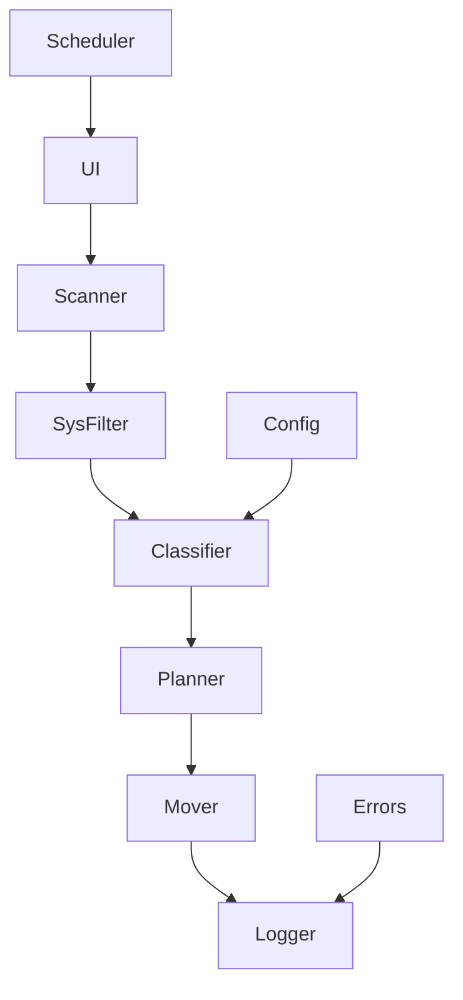

# 🤖 AutoOrganizer 系統規格書（v2.0）

**文件狀態**：草案 Draft → 送審 Ready  
**目標讀者**：開發、測試、維運、產品/專案管理  
**相依環境**：macOS 13+（Apple Silicon/Intel 皆可）

---

## 1. 系統概述
### 1.1 系統定位
**AutoOrganizer** 是 macOS 上的智慧檔案自動整理系統，提供從「規則化分類 → 安全搬移 → 報告與回滾」的一站式能力，支援 GUI 與 CLI、可排程無人值守。

### 1.2 設計目標
- **智慧化**：規則 +（可擴展）ML 的多層分類；可視化規則管理。
- **自動化**：支援 LaunchAgent 定時執行；內建執行鎖避免重入。
- **安全性**：原子搬移策略、雲端占位檔處理、權限自檢、可回滾。
- **可擴展**：模組化邏輯，規則以 JSON/Schema 驗證，可插件化。
- **易用性**：GUI（初版 PyQt6/tkinter 二選一）、CLI、乾跑（Dry-run）預覽、詳盡報告。

### 1.3 技術棧（更新）
| 層級 | 技術選型 | 目的/理由 |
|---|---|---|
| 核心引擎 | **Python 3.11（posix/pathlib/shutil）** | 穩定跨卷 I/O、較佳可測試性與可維護性 |
| 橋接 | AppleScript（選配） | 僅在需要 Finder 標籤/通知時 |
| GUI | Python + **PyQt6**（或 tkinter 初版） | GUI 元件成熟、表格/樹狀/日誌尾隨體驗完善 |
| 自動化 | Launch Agent | 系統級排程；單一機制、降低複雜度 |
| 配置 | JSON + JSON Schema | 可驗證、可版本遷移 |
| 儲存 | SQLite（去重索引/歷史） + 檔案日誌 | 輕量、單檔、易備份 |

> 備註：若前期已用 AppleScript 實作，保留為外掛；核心 I/O 與控制流由 Python 主導。

---

## 2. 系統架構設計
### 2.1 整體架構
```
UI Layer (GUI/CLI)
      ↓
Business Logic
  ├─ 檔案掃描器
  ├─ 系統/敏感過濾器
  ├─ 分類引擎（規則 → 可接 ML）
  ├─ 規劃器（Dry-run 計畫）
  └─ 執行器（安全搬移、回滾紀錄）
      ↓
Core Services
  ├─ 權限自檢       ├─ 日誌/度量
  ├─ 去重/SQLite    └─ 排程/執行鎖
      ↓
Automation / Persistence
  ├─ LaunchAgent（單一） 
  └─ 配置/規則/歷史/報告
```

### 2.2 模組依賴關係（mermaid）


---

## 3. 核心模組設計
### 3.1 檔案掃描模組（Scanner）
**職責**：依來源資料夾與掃描策略取得候選檔案清單；支援遞迴、檔案型別/大小/時間條件、忽略規則（.git、node_modules…）。  
**策略**：淺層/深度/選擇性（規則式）。  
**非功能需求**：10 萬級檔案可在合理時間產生候選（基準見 §10）。

### 3.2 系統檔案/敏感過濾器（SysFilter）
**規則類別**：  
- 雲端占位：iCloud/OneDrive/Dropbox 之 placeholder 檔 → 延後處理或標記「待下載」。  
- 隱藏與快取：`.DS_Store`、`Thumbs.db`、`__pycache__`、`.git` 等 → 跳過。  
- 長檔名/空檔/暫存前綴（~$ 等）→ 跳過。  
- **白名單**：允許使用者以關鍵字/路徑豁免跳過規則。  
- **敏感字**（檔名層級）：`password/密碼/private/機密/...` → 只標記不搬移（預設）。

### 3.3 分類引擎（Classifier）
**介面**：`classify(file_info) -> (category, confidence, rationale)`  
**決策來源**：副檔名（P1=100）、檔名關鍵字（P2=80）、大小（P3=50）、MIME（P4=60）、魔術數（P5=70）。  
**規則配置**：JSON + Schema（見 §5.2），支援版本號與遷移。  
**快取**：副檔名→類別 LRU 快取（上限 1000）。

### 3.4 規劃器（Planner / Dry-run）
**輸入**：來源目錄、目標根目錄、規則、選項。  
**輸出**：`PlanItem[]`（src、dst、op(rename/copy)、same_volume、size、conflict、estimated_ms）。  
**特性**：  
- **不進行任何實際 I/O**。  
- 名稱衝突偵測；跨卷判斷；估時（以歷史吞吐/檔案大小出估算）。  
- 可導出 `plan.json` 供執行器使用。

### 3.5 執行器（Mover）
**原子/安全策略**：  
- **同卷**：`os.rename`（原子）。  
- **跨卷**：`copy (buffered) → fsync → SHA-256 校驗成功 → 刪除來源`；失敗立即回滾。  
**重複策略**：  
- 檔名衝突：rename/skip/overwrite（預設 rename，加序號或 timestamp）。  
- **內容去重**：以 SHA-256 建索引（SQLite）；同 hash 視為重複群組，可選「僅保留一份/全部標籤/移入重複區」。  
**回滾**：執行同時寫 `rollback.json` + `rollback.sh`（逆向 move）；可一鍵復原。  
**進度回報**：每檔案事件（start/done/fail），更新度量。

---

## 4. 資料流程設計
### 4.1 主要流程
1) 初始化：載入規則與配置、檢查權限、建立日誌與資料庫。  
2) 掃描：產生候選清單與初步統計。  
3) 過濾：系統/敏感/白名單處理，建立處理佇列。  
4) 分類：計算類別、信心與依據；生成 `PlanItem`。  
5) **Dry-run**：輸出預覽（表格/JSON），接受者確認。  
6) 執行：遵循原子/安全策略進行；寫回滾檔；更新統計。  
7) 報告：產生摘要、錯誤列表、分類統計與建議；寫入日誌。  

### 4.2 主要資料結構（Python dataclass 摘要）
```python
from dataclasses import dataclass
from typing import Literal

@dataclass
class FileInfo:
    path: str
    name: str
    ext: str
    size: int
    ctime: float
    mtime: float
    source_dir: str
    is_system: bool = False
    category: str = ""
    confidence: int = 0

@dataclass
class PlanItem:
    src: str
    dst: str
    op: Literal["rename","copy"]
    same_volume: bool
    size: int
    conflict: bool = False
    estimated_ms: int = 0

@dataclass
class Stats:
    total: int
    moved: int
    skipped: int
    errors: int
    duplicated: int
    bytes_copied: int
    duration_ms: int
```

### 4.3 狀態機（精簡）
`IDLE → SCANNING → FILTERING → CLASSIFYING → PLANNING(DRYRUN) → EXECUTING → REPORTING → COMPLETED`  
中斷點：任一階段 `ERROR` 可停或回滾；使用者可 `PAUSED/RESUME/CANCELLED`。

---

## 5. 檔案分類引擎設計
### 5.1 決策矩陣（權重）
| 優先級 | 依據 | 權重 | 說明 |
|---|---|---|---|
| P1 | 副檔名 | 100 | `.pdf → PDF` |
| P2 | 檔名關鍵字 | 80 | `screenshot → 圖片` |
| P3 | 檔案大小 | 50 | `>100MB → 壓縮` |
| P4 | MIME | 60 | `image/jpeg → 圖片` |
| P5 | 魔術數 | 70 | 檔頭辨識 |

### 5.2 規則 Schema（要點）
- `classificationRules.version`（e.g. `"2.0"`）  
- `categories[].rules.extensions|keywords|mimeTypes|minSize|priority`  
- `defaultCategory`（id/name/emoji）  
- **驗收**：規則存檔前必須通過 JSON Schema 驗證；版本不符需觸發遷移。

### 5.3 自訂規則
- GUI/CLI 皆可匯入/匯出。  
- 動態新增規則於執行中生效（有風險）→ 預設僅允許「下次執行」生效。  
- 規則衝突處理：以權重 + 定義順序決議；保留 `rationale` 便於除錯。

---

## 6. 自動化執行機制
### 6.1 LaunchAgent（唯一排程機制）
- **安裝指令**：`ao install-launchagent --daily 22:00 --cmd "ao run --plan <path>"`  
- **移除指令**：`ao uninstall-launchagent`  
- **執行鎖**：檔案鎖（fcntl）確保同一時間只有一個實例執行；拿不到鎖即退出並記錄。

### 6.2 Automator（選配）
- 僅提供互通範例流程（GUI 觸發 CLI）；非必要不依賴。

### 6.3 智慧排程（簡版）
- 依「待處理檔案數量 + 系統負載 + 時段」決定是否執行 `quick/full/deep`。  
- 可關閉；一切以使用者指定排程為準。

### 6.4 多來源觸發協同
- 任何入口（手動/排程/GUI）一律經由 **執行鎖 + 佇列**；佇列按優先級與時間排序。

---

## 7. 錯誤處理與日誌系統
### 7.1 錯誤分級
- **FATAL**：權限不足、磁碟滿、資料庫損壞 → 立即停止、彈出指引、產生事件。  
- **ERROR**：單檔失敗（不存在/IO 例外）→ 跳過並記錄。  
- **WARNING/INFO/DEBUG**：如占位檔、規則缺欄位、重試等。

### 7.2 全域錯誤處理
- 以錯誤碼（表）對應建議行動；可本地化訊息。  
- 為關鍵錯誤生成「自助修復」指南 URL（README 錯誤碼章節）。

### 7.3 日誌設計（結構化）
- **格式**：單行 JSON：`ts, level, taskId, fileId(hash), action, bytes, ms, message`  
- **輪轉**：10MB × 5 份；崩潰前確保 flush。  
- **脫敏**：家目錄轉 `~/`，避免將個資寫入日誌。  
- **報告**：每次執行產出 `report.txt`/`report.json`（摘要、分類統計、錯誤摘要、建議）。

### 7.4 回滾
- 每次執行都生成 `rollback.json` + `rollback.sh`；即使中斷也可復原到執行前狀態（抽樣驗證）。

---

## 8. 使用者介面設計
### 8.1 GUI（PyQt6 首選 / tkinter 次選）
**分頁**：  
- 狀態（進度條、目前檔案、速度/估時）  
- **預覽（Dry-run）**：來源→目標、類別、信心、衝突；支援排序/篩選/匯出  
- 日誌尾隨（條件篩選）  
- 規則編輯器（表單 + JSON 檢視 + 即時驗證）  
- 重複群組（以 hash 群組樹狀檢視，提供批次動作）

**主按鈕**：Dry-run、Start（需 plan）、Rollback、Install/Uninstall LaunchAgent。  
**互動**：長任務在背景執行；UI 不阻塞；所有異常有錯誤碼與建議。

### 8.2 設計規範（Design Tokens）
- 色彩、字體、間距、圓角、陰影如原稿；支援 Light/Dark。  
- 可調字級；中文採系統字體 SF Pro（或思源黑體）。

---

## 9. 安全性設計
### 9.1 權限管理
- 啟動前自檢常用路徑存取；不足時給出 **Full Disk Access** 指引（系統偏好設定深連結）。  
- 不在未授權路徑嘗試搬移；直接標記並略過。

### 9.2 資料安全
- **跨卷必做** SHA-256 完整性校驗，通過才刪除來源。  
- 可選備份至指定的位置（副本一份），大檔案備份前顯示空間估算/警告。  

### 9.3 隱私
- 敏感詞命中 → 不搬移；僅打標籤或加入「需要審核」清單。  
- 日誌與報告做脫敏處理（遮蔽使用者名稱、Email 等）。

---

## 10. 效能優化設計
### 10.1 批次處理
- 搬移/複製以固定緩衝讀寫；批次更新進度；I/O 間插入微小 `yield` 降低卡頓。

### 10.2 記憶體管理
- 大清單分頁處理；預覽表格懶載入；統計以增量方式更新。

### 10.3 並行處理（審慎）
- 預設單工；可選多執行緒 hash 計算；I/O 搬移仍序列化以避免磁碟抖動與鎖競爭。

### 10.4 索引與事件（中期）
- Spotlight/MDQuery 產生候選集、FSEvents 監看增量（P2 路線）。

---

# 附錄 A｜CLI 規格
```
ao dry-run --source <dir> [--source <dir> ...] --target <dir> --rules <rules.json> --json plan.json
ao run --plan plan.json
ao dedup --source <dir> --report dedup.json
ao install-launchagent --daily HH:MM --cmd "<cli>"
ao uninstall-launchagent
ao rollback --file rollback.json
```
**行為**：所有命令可 `--json` 機器輸出；失敗回傳非 0。  
**驗收**：`dry-run` 不觸發 I/O；`run` 僅接受經 `dry-run` 產生的計畫。

---

# 附錄 B｜SQLite 結構（去重/歷史）
```sql
CREATE TABLE IF NOT EXISTS files(
  hash TEXT NOT NULL,
  path TEXT NOT NULL,
  size INTEGER,
  mtime REAL,
  PRIMARY KEY(hash, path)
);
CREATE INDEX IF NOT EXISTS idx_files_hash ON files(hash);

CREATE TABLE IF NOT EXISTS runs(
  task_id TEXT PRIMARY KEY,
  started_at TEXT,
  finished_at TEXT,
  total INTEGER, moved INTEGER, skipped INTEGER, errors INTEGER, duplicated INTEGER,
  bytes_copied INTEGER
);
```

---

# 附錄 C｜驗收標準（關鍵 KPI）
- **資料安全**：跨卷搬移抽樣 100% 通過 SHA-256 驗證；無「先刪後失敗」事故。  
- **可回滾**：中途拔電或故障後，依 `rollback.sh` 可恢復（抽樣 50 檔全過）。  
- **穩定性**：10 萬檔 Dry-run 於 10 分鐘級別內完成（視硬碟與規則，允收±）；執行過程不重入。  
- **可用性**：GUI 不凍結；預覽可排序/篩選；規則錯誤即時提示。  
- **日誌**：全程結構化、可輪轉；關鍵動作有 `fileId(hash)` 可追溯。  

---

# 附錄 D｜風險與對策
- **雲端占位檔**：讀不到內容 → 延後或先觸發下載；列入「待處理」。  
- **權限不足**：提前自檢與指引；不嘗試越權。  
- **網路磁碟/NAS**：I/O 慢/不穩 → 自動退避與重試（上限 3 次、指數回退）。  
- **極端長檔名/特殊字元**：在 Dry-run 提醒；提供自動安全改名策略。  

---

# 附錄 E｜未來路線（P2）
- Spotlight/FSEvents、敏感內容抽樣掃描、SwiftUI 狀態列 App、匿名遙測（預設關閉）。
