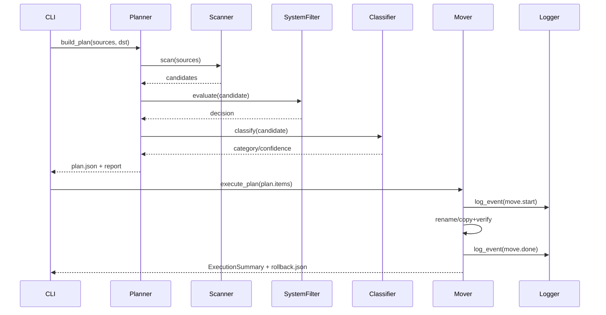

# AutoOrganizer Architecture Notes

## Planner / Mover / Logger Interaction

The planner orchestrates scanning, filtering, and classification to produce a `plan.json`
without touching the file system. When executing `run --plan`, the mover performs atomic
renames on the same volume and safe copy+verify sequences across volumes. Every significant
step emits structured JSON lines via the logger, which handles log rotation, home directory
redaction, and log level control.
